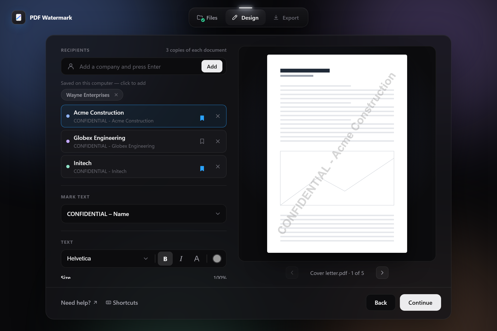
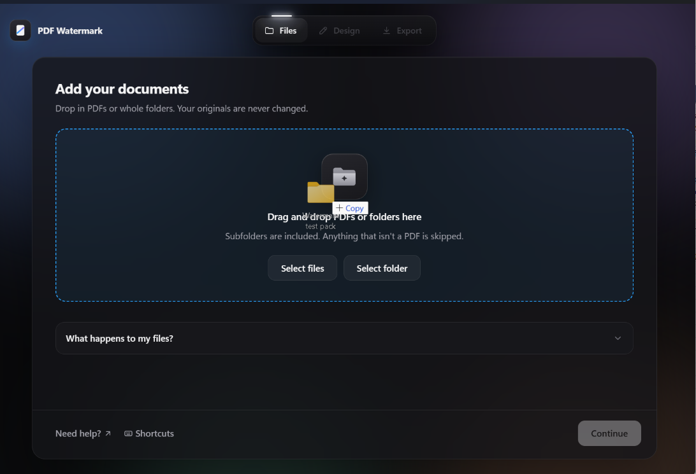
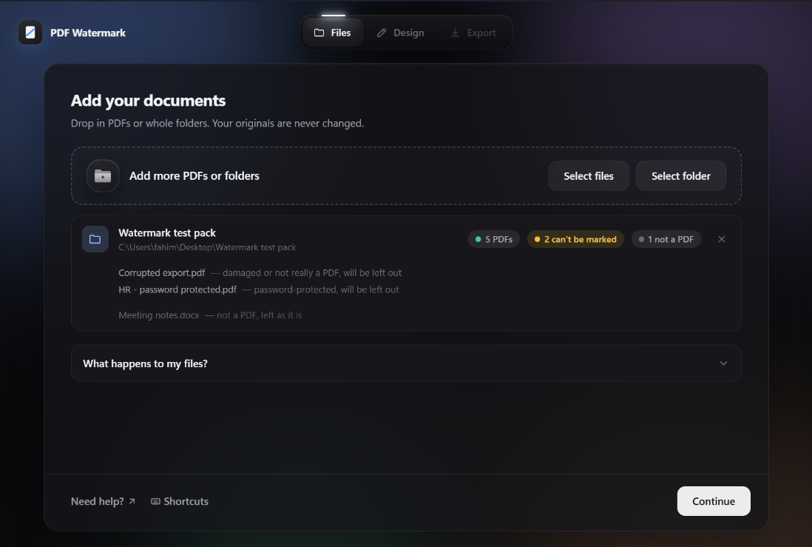
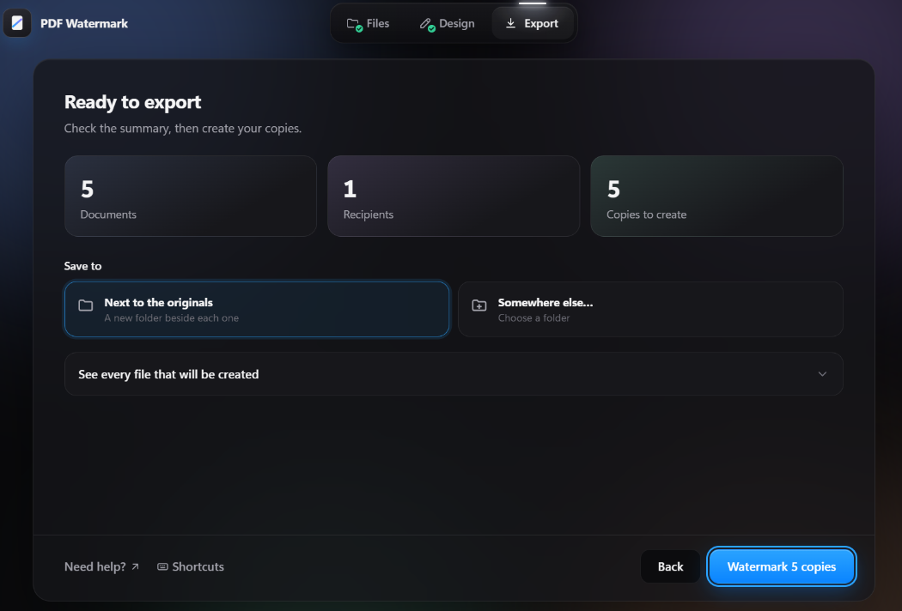

<div align="center">
<h1 align="center">

<br>
PDF Watermark
</h1>
<h3 align="center">📍 Mark every page with who it was sent to — one file, a whole folder, or one copy per recipient.</h3>
<h3 align="center">⚙️ Developed with the software and tools below:</h3>

<p align="center">


</p>

<p align="center">
<a href="https://github.com/Fahim8371/pdf-watermark/releases/latest"></a>
<a href="https://github.com/Fahim8371/pdf-watermark/releases"></a>
<a href="https://github.com/Fahim8371/pdf-watermark/actions/workflows/ci.yml"></a>
<a href="LICENSE"></a>
</p>



</div>

---

## 📚 Table of Contents
- [📚 Table of Contents](#-table-of-contents)
- [📍 Overview](#-overview)
- [💫 Features](#-features)
- [💿 Download](#-download)
- [📂 Project Structure](#-project-structure)
- [🧩 Modules](#-modules)
- [🚀 Getting Started](#-getting-started)
- [🤖 Using PDF Watermark](#-using-pdf-watermark)
- [🗺 Roadmap](#-roadmap)
- [🔏 Code signing policy](#-code-signing-policy)
- [🔒 Privacy and uninstalling](#-privacy-and-uninstalling)
- [🤝 Contributing](#-contributing)
- [📄 License](#-license)
- [👏 Acknowledgments](#-acknowledgments)

---

## 📍 Overview

PDF Watermark stamps text across the pages of PDF documents so every copy you
send out can be traced back to whoever received it. Point it at a single file
or a whole folder of drawings and reports, add the companies the pack is going
to, and it writes a separately marked copy of everything for each one —
*CONFIDENTIAL – Acme Construction* on Acme's copy, *CONFIDENTIAL – Globex* on
Globex's.

It comes as a **desktop app for Windows** — no install, no account, nothing
uploaded anywhere — and as a **command line tool** for scripts, both driven by
the same engine. Originals are never changed; every marked document is a new copy.

It was written for mixed technical document sets: a folder holding A4 letters
next to A0 CAD drawings, rotated and cropped sheets, and files from software
that writes unusual PDFs. Each page is measured on its own, so the mark looks
right on all of them.

---

## 💫 Features

| Feature | Description |
|---|---|
| **👥 One copy per recipient** | Add any number of companies and get a separately marked copy of the whole pack for each. Companies you send to often can be saved on your computer and added with one click. |
| **📁 Whole folders at once** | Subfolders included and their structure kept. Anything that isn't a PDF is left alone, and damaged or password-protected files are flagged the moment you add them — not halfway through an export. |
| **👀 Live preview** | The preview is the real result, rendered on your own pages. Click a company to see their copy; flip through every document before anything is written. |
| **🎨 Styles that fit the page** | A bold diagonal corner to corner, a repeating tiled pattern, or a small stamp in any corner, along any edge, or wherever you drag it. Sized from each page's own dimensions, so an A4 letter and an A0 drawing both look right. |
| **🔤 Fonts and colours** | Any font installed on your computer, with bold and italic, any colour, adjustable strength and size, and outline letters. Fonts are embedded so copies look the same everywhere. |
| **🗓 Placeholders** | `{date}`, `{page}`, `{pages}` and `{file}` are filled in for each page — e.g. *DRAFT – 2026-10-05 – page 3 of 12*. |
| **🔒 Extra protection** | Optionally turn pages into images, so the mark can't be selected, searched for or deleted. |
| **🧱 Made for awkward PDFs** | Rotated and cropped pages, CAD drawings with unusual internals, files that restrict editing (their restrictions are kept), and names in any script — Cyrillic, Greek, Chinese, Japanese, Korean. |
| **⌨️ Keyboard shortcuts** | Bold, italic, layouts, stamp positions, paging through documents — press <kbd>?</kbd> in the app for the full list. |
| **🖥 Command line** | Every option is also a flag, for batch jobs and scripts, with a dry-run mode and a proper exit code. |

---

## 💿 Download

📦 **[PDF-Watermark-Windows.exe](https://github.com/Fahim8371/pdf-watermark/releases/latest/download/PDF-Watermark-Windows.exe)** — about 32 MB

> 💡 Runs on Windows 10 and 11. Nothing to install: download it and double-click.
> The first time, Windows may show *"Windows protected your PC"* because the app
> isn't code-signed yet — click **More info**, then **Run anyway**. It only asks once.

All versions are on the [Releases page](https://github.com/Fahim8371/pdf-watermark/releases).
A Mac version is planned; in the meantime the command line runs on macOS and Linux.

Windows releases are built by GitHub Actions straight from this repository and
code-signed through the SignPath Foundation — see the [code signing policy](#-code-signing-policy).

---


## 📂 Project Structure

```bash
pdf-watermark
├── app.py                  # the desktop app: a window around the engine
├── batch_watermark.py      # the command line
├── watermark.py            # the engine: geometry, rotation, drawing, saving
├── fonts.py                # built-in and installed fonts
├── ui
│   ├── index.html
│   ├── styles.css
│   └── app.js
├── tests
│   ├── conftest.py
│   ├── test_engine.py
│   └── test_batch.py
├── examples
│   └── make_sample.py      # a sample document to practise on
├── docs
│   ├── make_figures.py     # draws the images in this README
│   └── screenshots
├── packaging
│   ├── pdf-watermark.spec  # PyInstaller build
│   ├── make_icons.py
│   └── icon.png / .ico / .icns
├── .github/workflows
│   ├── ci.yml              # tests on every push
│   └── release.yml         # builds and publishes the app on a version tag
├── requirements.txt
├── requirements-dev.txt
├── VERSION
└── LICENSE
```

---


## 🧩 Modules

<details closed><summary>Root</summary>

| File | Summary |
|:---|:---|
| [app.py](app.py) | The desktop app. Opens a window (pywebview) showing the interface in `ui/`, and gives it a bridge to Python: picking files, checking each PDF can be read, rendering previews, listing fonts, running the export on a background thread, and remembering settings and saved companies. Keeps a log for diagnosing problems on someone else's computer. |
| [watermark.py](watermark.py) | The engine. Works out the font size, angle and position for each page from its own geometry; brings rotated pages to a rotation-free state while keeping their crop boxes; fences off CAD drawings' stray transforms; draws the text; fills in placeholders; flattens pages to images on request; and saves through a temporary file so a failed run never leaves a half-written PDF. |
| [fonts.py](fonts.py) | Finds the fonts installed on Windows, macOS or Linux, groups them into families with their bold and italic styles, and embeds only the characters a watermark uses, so a copy grows by kilobytes rather than megabytes. |
| [batch_watermark.py](batch_watermark.py) | The command line. Collects PDFs from files and folders (case-insensitively, skipping macOS metadata files), names every output so nothing overwrites anything else, and applies one or many watermark texts in a run. |

</details>

<details closed><summary>ui</summary>

| File | Summary |
|:---|:---|
| [index.html](ui/index.html) | The three steps — Files, Design, Export — plus the shortcuts sheet. |
| [styles.css](ui/styles.css) | The dark theme: the spotlight step bar, cards, toolbar, menus and tooltips. |
| [app.js](ui/app.js) | Everything the interface does. Talks to `app.py`, or to a built-in mock with sample data when opened in a plain browser — handy for design work (`?demo=design`). |

</details>

<details closed><summary>tests</summary>

| File | Summary |
|:---|:---|
| [test_engine.py](tests/test_engine.py) | Renders watermarked pages and checks where the ink actually lands: centred on every page size and rotation, in the right corner for every stamp position, pixel-identical page content after de-rotation, kept bookmarks and links, restrictions, fonts, flattening. |
| [test_batch.py](tests/test_batch.py) | Finding PDFs, naming outputs, and the command line run end to end — including recipient names in Polish and Japanese. |

</details>

<details closed><summary>packaging & docs</summary>

| File | Summary |
|:---|:---|
| [pdf-watermark.spec](packaging/pdf-watermark.spec) | Builds the single-file Windows `.exe` (and a macOS `.app`, for later). |
| [make_icons.py](packaging/make_icons.py) | Draws the app icon in each platform's format. |
| [make_figures.py](docs/make_figures.py) | Draws the example images in this README with the real engine, so they always match what the tool produces. |

</details>

---

## 🚀 Getting Started

### ✅ Prerequisites

> - **The app:** Windows 10 or 11. Nothing else.
> - **The command line, or running from source:** Python 3.10 or newer, on Windows, macOS or Linux.

### 🖥 Installation

**The app** — [download PDF-Watermark-Windows.exe](#-download) and double-click it.

**From source:**

1. Clone the repository:
```sh
git clone https://github.com/Fahim8371/pdf-watermark.git
```

2. Change to the project directory:
```sh
cd pdf-watermark
```

3. Install the dependencies:
```sh
pip install -r requirements.txt
```

4. Start the app, or use the command line:
```sh
python app.py
python batch_watermark.py --help
```

---

## 🤖 Using PDF Watermark

### The app

There are several ways to get your documents in:

1. **Drag and drop** PDFs or whole folders onto the window.
2. **Select files** or **Select folder** to browse for them.
3. **Drop them onto the app's icon** — or the `.exe` itself — and it opens with them already added.

 

The **Files** step shows what it found — and which files it will leave out and why.

Then, on **Design**, add the companies the copies are for and choose how the
mark looks and where it sits; the preview updates as you go. On **Export**,
check the summary and the list of files that will be created, pick where they
go, and click **Watermark**.



### ⌨️ Keyboard shortcuts

| Keys | Does |
| --- | --- |
| <kbd>Ctrl</kbd> <kbd>O</kbd> · <kbd>Ctrl</kbd> <kbd>Shift</kbd> <kbd>O</kbd> | Add PDFs · add a folder |
| <kbd>Ctrl</kbd> <kbd>Enter</kbd> | Continue, or start the export |
| <kbd>Ctrl</kbd> <kbd>B</kbd> · <kbd>Ctrl</kbd> <kbd>I</kbd> · <kbd>Ctrl</kbd> <kbd>Shift</kbd> <kbd>L</kbd> | Bold · italic · outline letters |
| <kbd>Ctrl</kbd> <kbd>Shift</kbd> <kbd>F</kbd> | Choose a font |
| <kbd>D</kbd> · <kbd>T</kbd> · <kbd>S</kbd> | Diagonal · tiled · stamp |
| <kbd>1</kbd> – <kbd>9</kbd> | Put the stamp in that spot, laid out like a number pad (<kbd>7</kbd> top left, <kbd>3</kbd> bottom right) |
| Arrow keys | Nudge the stamp — hold <kbd>Shift</kbd> for bigger steps |
| <kbd>[</kbd> · <kbd>]</kbd> | Previous · next document in the preview |
| <kbd>?</kbd> | Show every shortcut |

### 🎨 Styles


The size is worked out from each page, so one run handles documents whose pages
disagree about how big they are — and a diagonal always runs corner to corner:


### The command line

- Show help:
    ```
    python batch_watermark.py --help
    ```
- One marked copy of a folder per company:
    ```
    python batch_watermark.py my_folder --company "Acme" "Globex"
    ```
- Your own text, with the date and page numbers filled in on every page:
    ```
    python batch_watermark.py report.pdf --text "DRAFT - {date} - page {page} of {pages}"
    ```
- A small red stamp in the bottom-right corner, in an installed font:
    ```
    python batch_watermark.py my_folder --company Acme --position bottom-right --color red --font "Arial"
    ```
- See exactly what would be written, without writing anything:
    ```
    python batch_watermark.py my_folder --company Acme --dry-run
    ```

New to it? `python examples/make_sample.py` writes a sample document to practise on.

<details closed><summary>Every option</summary>

| Flag | Default | What it does |
| --- | --- | --- |
| `--text`, `-t` | — | Watermark text. Repeat for one set of copies per text. Placeholders: `{date}` `{page}` `{pages}` `{file}`. |
| `--company`, `-c` | — | Each name becomes `CONFIDENTIAL - <name>`. |
| `--prefix` | `CONFIDENTIAL` | What `--company` puts before each name; `""` for the name alone. |
| `--layout` | `diagonal` | `diagonal`, `tile`, or `position` for a small stamp. |
| `--position` | `bottom-center` | Where a stamp goes: `top-left` … `bottom-right`, `center`, or `X,Y` fractions like `0.8,0.1`. |
| `--stack` | off | Put the name on its own line under the prefix. |
| `--font` | `Helvetica` | `Helvetica`, `Times`, `Courier`, or any installed font such as `"Georgia"`. |
| `--bold` / `--no-bold`, `--italic` | bold | Font style. |
| `--color` | grey | A name (`red`, `blue`, `black`, `green`, `grey`) or a hex code like `#cc0000`. |
| `--opacity` | `0.4` | `0` invisible, `1` fully opaque. |
| `--size` | `100` | Percent of the automatic size (up to 400 for stamps). |
| `--angle` | `diagonal` | Degrees, or `diagonal` for corner to corner on every page. |
| `--tile N` | — | Shorthand for `--layout tile` with N bands. |
| `--outline` | off | Hollow letters. |
| `--flatten [DPI]` | off | Turn pages into images so the mark can't be removed. |
| `--out`, `-o` | next to each source | Where output is written. |
| `--suffix` | `_Watermarked` | Appended to each output folder name. |
| `--dry-run` | off | Print what would be written, write nothing. |

The exit code is `0` when every file succeeded and `1` if any failed, so it can sit in a script.

</details>

### 📂 Where the output goes

```
my_folder/                                     <- untouched
    report.pdf
    drawings/plan.pdf
my_folder _CONFIDENTIAL - Acme_Watermarked/    <- created next to it
    report_watermarked.pdf
    drawings/plan_watermarked.pdf
```

A single file is written next to the original as `report_watermarked.pdf`.
Re-running is safe: earlier output is recognised and skipped, so watermarks
never stack up.

### 🩺 If something goes wrong

- **A file shows "can't be marked"** — it is damaged or needs a password. Open it, save an unprotected copy, and add that.
- **The app misbehaves** — it keeps a log at `%APPDATA%\PDF Watermark\app.log`. Attaching it to an [issue](https://github.com/Fahim8371/pdf-watermark/issues) makes the problem much quicker to find.
- **A watermark is not access control.** It marks where a copy came from and discourages passing it on. *Extra protection* makes it much harder to remove; for real restrictions, use encryption or a rights-management system.

---

## 🗺 Roadmap

> - [x] Desktop app for Windows, downloadable from Releases
> - [x] One copy per recipient, saved companies
> - [x] Diagonal, tiled and stamp layouts, drag-to-place stamps
> - [x] Installed fonts, bold and italic, colours, outline letters
> - [x] Placeholders: `{date}` `{page}` `{pages}` `{file}`
> - [x] Flatten to images (*Extra protection*)
> - [x] Tests on Windows, macOS and Linux for every change
> - [ ] Mac app
> - [ ] Code-signed builds, so the first-launch prompt goes away
> - [ ] Image and logo watermarks
> - [ ] Entering a password for protected PDFs inside the app
> - [ ] Faster exports by marking several files at once

---

## 🔏 Code signing policy

Free code signing provided by [SignPath.io](https://about.signpath.io/), certificate by [SignPath Foundation](https://signpath.org/).

Every Windows release is built by the [release workflow](.github/workflows/release.yml)
on GitHub Actions directly from the source code in this repository, and only
those builds are submitted for signing.

| Role | Members |
| --- | --- |
| Committers and reviewers | [Fahim8371](https://github.com/Fahim8371) |
| Approvers | [Fahim8371](https://github.com/Fahim8371) |

Changes from anyone outside the committers are reviewed before they are merged,
and every signing request is approved by an approver. All team members use
multi-factor authentication for GitHub and SignPath.

---

## 🔒 Privacy and uninstalling

**Privacy policy:** This program will not transfer any information to other
networked systems unless specifically requested by the user or the person
installing or operating it. Your documents are processed entirely on your own
computer. The only time the app goes online is if you click *Need help?*,
which opens this page in your web browser.

**What it changes on your computer:** nothing is installed. The app keeps its
settings, the companies you choose to save, a font list and a small log in one
folder: `%APPDATA%\PDF Watermark` on Windows.

**Uninstalling:** delete `PDF-Watermark-Windows.exe`, and if you want to remove
your settings and saved companies too, delete the `%APPDATA%\PDF Watermark`
folder (paste that into the File Explorer address bar to find it).

---

## 🤝 Contributing

Contributions are always welcome! Please follow these steps:
1. Fork the project repository.
2. Clone your fork and create a branch with a descriptive name:
```sh
git checkout -b fix-rotated-stamp
```
3. Install the development tools:
```sh
pip install -r requirements-dev.txt
```
4. Make your change, and add a test in `tests/` that would have caught the problem.
5. Check the tests and the linter both pass:
```sh
python -m pytest
ruff check .
```
6. Commit, push to your fork, and open a pull request describing what changed and why.

The test suite builds every PDF it needs on the fly — please never commit real documents.

### 🔨 Building and releasing

```sh
pyinstaller packaging/pdf-watermark.spec --noconfirm   # builds dist/PDF Watermark.exe
```

Releases are built by GitHub Actions: update the `VERSION` file, commit, then
`git tag v1.1.0 && git push --follow-tags`. The [release workflow](.github/workflows/release.yml)
runs the tests, builds the `.exe` and publishes it on the Releases page.

---

## 📄 License

The code in this repository is licensed under the `MIT` License. See the [LICENSE](LICENSE) file for additional info.

The downloadable app bundles [PyMuPDF](https://pymupdf.readthedocs.io/), which is
licensed under the [GNU AGPL v3](https://www.gnu.org/licenses/agpl-3.0.html), so the
app as distributed is covered by the AGPL's terms; its complete source is this repository.

---

## 👏 Acknowledgments

- [PyMuPDF](https://pymupdf.readthedocs.io/) — reading, drawing on and writing PDFs
- [fontTools](https://github.com/fonttools/fonttools) — reading and subsetting fonts
- [pywebview](https://pywebview.flowrl.com/) — the app window
- Ideas borrowed from other open-source watermarking tools:
  [bastienlc/pdf-watermark](https://github.com/bastienlc/pdf-watermark),
  [ajaxray/markpdf](https://github.com/ajaxray/markpdf),
  [oclero/pdfwm](https://github.com/oclero/pdfwm),
  [aanorlondo/pdf-watermark](https://github.com/aanorlondo/pdf-watermark) and
  [TobseF/My-PDF-Watermark](https://github.com/TobseF/My-PDF-Watermark)
