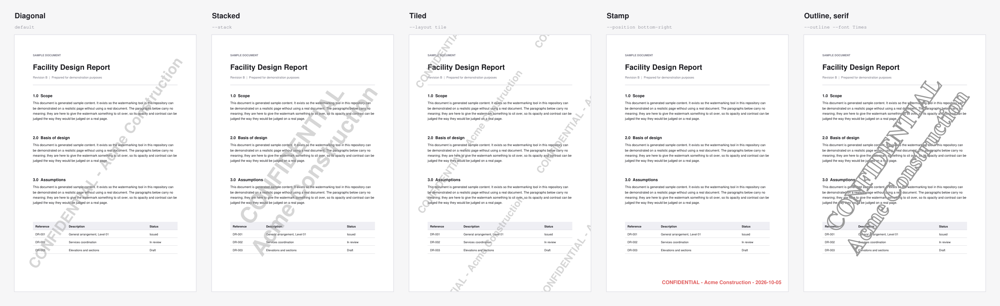
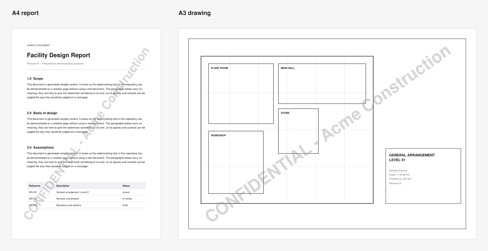

<div align="center">


# PDF Watermark

**Mark every page of a PDF with who it was sent to — one file, a whole folder,<br>
or the same document pack marked separately for each recipient.**

[](https://github.com/Fahim8371/pdf-watermark/releases/latest)
[](https://github.com/Fahim8371/pdf-watermark/releases)
[](https://github.com/Fahim8371/pdf-watermark/actions/workflows/ci.yml)

[](LICENSE)

**[⬇ Windows](https://github.com/Fahim8371/pdf-watermark/releases/latest/download/PDF-Watermark-Windows.exe)**
&nbsp;·&nbsp;
**[⬇ Mac (Apple Silicon)](https://github.com/Fahim8371/pdf-watermark/releases/latest/download/PDF-Watermark-macOS-Apple-Silicon.dmg)**
&nbsp;·&nbsp;
**[⬇ Mac (Intel)](https://github.com/Fahim8371/pdf-watermark/releases/latest/download/PDF-Watermark-macOS-Intel.dmg)**
&nbsp;·&nbsp;
[All releases](https://github.com/Fahim8371/pdf-watermark/releases)


</div>

Free, open source and entirely offline: no account, no upload, nothing leaves
your computer. Originals are never changed — every marked document is a new copy.

---

## 📚 Contents

- [⭐ Features](#-features)
- [💿 Download and first launch](#-download-and-first-launch)
- [🖱 Using the app](#-using-the-app)
- [🎨 Styles and placement](#-styles-and-placement)
- [⌨️ Command line](#️-command-line)
- [📂 Where the output goes](#-where-the-output-goes)
- [🧩 How it fits together](#-how-it-fits-together)
- [🛠 Run, test and build from source](#-run-test-and-build-from-source)
- [🩺 Troubleshooting](#-troubleshooting)
- [⚠️ Notes and limitations](#️-notes-and-limitations)
- [🗺 Roadmap](#-roadmap)
- [🤝 Contributing](#-contributing)

---

## ⭐ Features

- **One copy per recipient.** Add Acme, Globex and Initech and get three marked
  copies of the whole pack, each traceable to whoever it went to. Companies you
  send to often can be saved on your computer and added with one click.
- **Whole folders at once.** Subfolders included, structure kept, anything that
  isn't a PDF left alone. Damaged and password-protected files are flagged the
  moment you add them, not halfway through an export.
- **Live preview.** See the real result on your own pages before anything is
  written, recipient by recipient, document by document.
- **Styles that fit the page.** A bold diagonal corner to corner, a repeating
  tiled pattern, or a small stamp in any corner, edge or spot you drag it to —
  sized from each page's own dimensions, so an A4 letter and an A0 drawing in
  the same pack both look right.
- **Any font on your computer**, with bold and italic, any colour, outline
  letters, and placeholders like `{date}` and `{page} of {pages}`.
- **Extra protection.** Optionally turn pages into images so the mark can't be
  selected, searched for or deleted.
- **Made for awkward PDFs.** Rotated pages, cropped pages, CAD drawings with
  unusual internals, files that restrict editing (their restrictions are kept),
  names in any script — Cyrillic, Greek, Chinese, Japanese, Korean.
- **Keyboard friendly.** Shortcuts for everything; press <kbd>?</kbd> in the app to see them.
- **A command line too**, for scripts and automation, sharing the same engine.

---

## 💿 Download and first launch

| Your computer | Download | First launch |
| --- | --- | --- |
| **Windows** 10 or 11 | [PDF-Watermark-Windows.exe](https://github.com/Fahim8371/pdf-watermark/releases/latest/download/PDF-Watermark-Windows.exe) | Double-click it — nothing to install. If you see *"Windows protected your PC"*, click **More info → Run anyway**. |
| **Mac** with Apple Silicon (M1 and newer) | [PDF-Watermark-macOS-Apple-Silicon.dmg](https://github.com/Fahim8371/pdf-watermark/releases/latest/download/PDF-Watermark-macOS-Apple-Silicon.dmg) | Open the .dmg and drag **PDF Watermark** into **Applications**. See below for the one-time security step. |
| **Mac** with an Intel processor | [PDF-Watermark-macOS-Intel.dmg](https://github.com/Fahim8371/pdf-watermark/releases/latest/download/PDF-Watermark-macOS-Intel.dmg) | As above. Not sure which Mac you have? Apple menu → **About This Mac**. |

**The one-time security step on a Mac.** The first time you open the app,
macOS says it *"could not verify PDF Watermark is free of malware"*. That is
because the app isn't signed with a paid Apple developer certificate, not
because anything is wrong with it. Click **Done**, then open
**System Settings → Privacy & Security**, scroll to the bottom, and click
**Open Anyway** next to PDF Watermark. You only do this once.

> 💡 Prefer not to run downloaded apps? Everything here also runs from the
> source code with Python — see [Run, test and build from source](#-run-test-and-build-from-source).

---

## 🖱 Using the app

Three steps, along the top of the window:

**1. Files** — drag in PDFs or whole folders, or use *Select files* /
*Select folder*. You can also drop PDFs straight onto the app's icon.

**2. Design** — add the companies the copies are for, then pick the wording
(*CONFIDENTIAL – Name*, with or without today's date, or your own), the font,
colour and strength, and where the mark goes. The preview on the right is the
real result; click a company to see their copy, and use the arrows to flip
through your documents.

**3. Export** — check the summary and the full list of files that will be
created, choose where they go, and click **Watermark**.

### Keyboard shortcuts

| Keys | Does |
| --- | --- |
| <kbd>Ctrl</kbd> <kbd>O</kbd> / <kbd>Ctrl</kbd> <kbd>Shift</kbd> <kbd>O</kbd> | Add PDFs / add a folder |
| <kbd>Ctrl</kbd> <kbd>Enter</kbd> | Continue, or start the export |
| <kbd>Ctrl</kbd> <kbd>B</kbd> · <kbd>Ctrl</kbd> <kbd>I</kbd> · <kbd>Ctrl</kbd> <kbd>Shift</kbd> <kbd>L</kbd> | Bold · italic · outline letters |
| <kbd>Ctrl</kbd> <kbd>Shift</kbd> <kbd>F</kbd> | Choose a font |
| <kbd>D</kbd> · <kbd>T</kbd> · <kbd>S</kbd> | Diagonal · tiled · stamp |
| <kbd>1</kbd>–<kbd>9</kbd> | Put the stamp in that spot, laid out like a number pad (<kbd>7</kbd> top left, <kbd>3</kbd> bottom right) |
| Arrow keys | Nudge the stamp (hold <kbd>Shift</kbd> for bigger steps) |
| <kbd>[</kbd> · <kbd>]</kbd> | Previous · next document in the preview |
| <kbd>?</kbd> | Show all shortcuts |

On a Mac, use <kbd>⌘</kbd> wherever this says <kbd>Ctrl</kbd>.

---

## 🎨 Styles and placement



The watermark is sized from each page's own geometry, so one run handles a
document whose pages disagree about how big they are — and a diagonal always
runs corner to corner, whatever the page shape:



---

## ⌨️ Command line

Everything the app does is available from a terminal, which suits scripts and
scheduled jobs. Python 3.10 or newer:

```
git clone https://github.com/Fahim8371/pdf-watermark.git
cd pdf-watermark
pip install -r requirements.txt
```

```
# Every PDF in a folder, one marked copy per company
python batch_watermark.py my_folder --company "Acme" "Globex"

# Your own text, with today's date and page numbers filled in on each page
python batch_watermark.py report.pdf --text "DRAFT - {date} - page {page} of {pages}"

# A small red stamp in the bottom-right corner, in an installed font
python batch_watermark.py my_folder --company Acme --position bottom-right --color red --font "Arial"

# See exactly what would be written, without writing anything
python batch_watermark.py my_folder --company Acme --dry-run
```

New to the command line? `python examples/make_sample.py` writes a sample
document to practise on, so your first run is not against something that matters.

| Flag | Default | What it does |
| --- | --- | --- |
| `--text`, `-t` | — | Watermark text. Repeat for one set of copies per text. Placeholders: `{date}` `{page}` `{pages}` `{file}`. |
| `--company`, `-c` | — | Each name becomes `CONFIDENTIAL - <name>`. |
| `--prefix` | `CONFIDENTIAL` | What `--company` puts before each name; `""` for the name alone. |
| `--layout` | `diagonal` | `diagonal`, `tile`, or `position` for a small stamp. |
| `--position` | `bottom-center` | Where a stamp goes: `top-left` … `bottom-right`, `center`, or `X,Y` fractions like `0.8,0.1`. |
| `--stack` | off | Put the name on its own line under the prefix. |
| `--font` | `Helvetica` | `Helvetica`, `Times`, `Courier`, or any installed font such as `"Georgia"`. |
| `--bold` / `--no-bold`, `--italic` | bold | Font style. |
| `--color` | grey | A name (`red`, `blue`, `black`, `green`, `grey`) or a hex code like `#cc0000`. |
| `--opacity` | `0.4` | `0` invisible, `1` fully opaque. |
| `--size` | `100` | Percent of the automatic size (up to 400 for stamps). |
| `--angle` | `diagonal` | Degrees, or `diagonal` for corner to corner on every page. |
| `--tile` | — | Shorthand for `--layout tile` with N bands. |
| `--outline` | off | Hollow letters. |
| `--flatten [DPI]` | off | Turn pages into images so the mark can't be removed. |
| `--out`, `-o` | next to each source | Where output is written. |
| `--suffix` | `_Watermarked` | Appended to each output folder name. |
| `--dry-run` | off | Print what would be written, write nothing. |

Run `python batch_watermark.py --help` for the full list at any time. The exit
code is `0` when every file succeeded and `1` if any failed, so it can sit in
a script or CI step.

---

## 📂 Where the output goes

A folder is copied to a sibling folder next to it, with its structure preserved:

```
my_folder/                                     <- untouched
    report.pdf
    drawings/plan.pdf
my_folder _CONFIDENTIAL - Acme_Watermarked/    <- created
    report_watermarked.pdf
    drawings/plan_watermarked.pdf
```

A single file is written next to the original as `report_watermarked.pdf`.
`--out DIR` (or *Somewhere else…* in the app) sends either one elsewhere. Two
sources that would land in the same place — two folders both called `Docs` —
are numbered rather than overwriting each other. Re-running is safe: earlier
output is recognised and skipped, so watermarks never stack up.

---

## 🧩 How it fits together

```
pdf-watermark/
├── app.py               the desktop app: a window around the engine
├── ui/                  the app's interface (HTML, CSS, JavaScript)
├── watermark.py         the engine: page geometry, rotation, drawing, saving
├── fonts.py             built-in and installed fonts, subset for embedding
├── batch_watermark.py   the command line: finding PDFs, naming output
├── tests/               the test suite, run on every push
├── examples/            a sample document to practise on
├── docs/                README images, and the script that draws them
└── packaging/           app icon and the PyInstaller build
```

The engine can be used from your own Python code:

```python
import watermark as wm

style = wm.Style(text="CONFIDENTIAL - Acme - {date}", layout="position", position=(1, 1))
wm.watermark_file("report.pdf", "report_watermarked.pdf", style)
```

Three things it does that a simple "insert text" loop does not:

- **Per-page sizing.** The size comes from each page's width, height and the
  angle, so the text fills an A4 letter and an A0 drawing alike.
- **Rotated and cropped pages.** A page with a `/Rotate` entry draws in a
  rotated space, which mirrors a naive watermark. Pages are first brought to a
  rotation-free state — with every page box carried over, so content the
  author cropped away stays hidden in the copy.
- **CAD-generated PDFs.** Some leave an unbalanced transform at the start of the
  page, which drags anything added afterwards into the wrong place. The
  existing content is fenced off first, without the font re-encoding that the
  usual fix does and that can corrupt these files.

---

## 🛠 Run, test and build from source

```
pip install -r requirements-dev.txt
python app.py                 # the desktop app
python -m pytest              # the test suite
ruff check .                  # lint
pyinstaller packaging/pdf-watermark.spec --noconfirm   # build the app for this computer
```

**Releases are built by GitHub Actions.** Update the `VERSION` file, commit,
then tag and push:

```
git tag v1.1.0
git push --follow-tags
```

The [release workflow](.github/workflows/release.yml) runs the tests, builds
the Windows `.exe` and both Mac `.dmg` files, and publishes them on the
Releases page — the download links at the top of this page then point at them.

---

## 🩺 Troubleshooting

**The app won't open on a Mac** — see the [one-time security step](#-download-and-first-launch).

**A file shows "can't be marked"** — it is damaged or needs a password to open.
Open it, save an unprotected copy, and add that instead.

**Something went wrong in the app** — it keeps a log at
`%APPDATA%\PDF Watermark\app.log` on Windows and
`~/Library/Application Support/PDF Watermark/app.log` on a Mac. Attaching it to
an [issue](https://github.com/Fahim8371/pdf-watermark/issues) makes the problem
much quicker to find.

**`ModuleNotFoundError` from the command line** — install the dependencies for
the Python you are running: `python -m pip install -r requirements.txt`.

**`no watermark text given`** — every command-line run needs `--text` or
`--company`. There is no default on purpose: a mark naming the wrong party is
worse than none.

**The watermark is too faint or too loud** — `--opacity` first (the *Strength*
slider in the app), then the tiled layout if it needs to be genuinely hard to remove.

---

## ⚠️ Notes and limitations

- **A watermark is not access control.** It is drawn as page content, so it
  marks where a copy came from and discourages passing it on; it does not stop
  someone determined. *Extra protection* (`--flatten`) makes it far harder to
  remove, at the cost of bigger files and no selectable text. For real
  restrictions, use encryption or a rights-management system.
- **Password-protected PDFs** are flagged and left out. Files that only
  restrict editing or printing are marked, and keep their restrictions.
- **Arabic and other joined scripts** are drawn right-to-left but without
  joining the letters, so they are legible but not typographically correct.
- **Installed fonts** are embedded in each copy — only the characters used, so
  it adds a few kilobytes. A font that isn't installed on the computer doing
  the marking falls back to Helvetica rather than failing the run.
- **Long paths on Windows** are handled, including network shares.

---

## 🗺 Roadmap

✅ Desktop app for Windows and macOS, downloadable from Releases<br>
✅ One copy per recipient, saved companies<br>
✅ Diagonal, tiled and stamp layouts; drag-to-place stamps<br>
✅ Installed fonts, bold and italic, colours, outline letters<br>
✅ Placeholders: `{date}` `{page}` `{pages}` `{file}`<br>
✅ Flatten to images (*Extra protection*)<br>
✅ Tests on Windows, macOS and Linux for every change<br>
⏺ Code-signed builds, so the first-launch prompts go away<br>
⏺ Image and logo watermarks<br>
⏺ Entering a password for protected PDFs inside the app<br>
⏺ Faster exports by marking several files at once<br>
⏺ Light theme

---

## 🤝 Contributing

Bug reports, ideas and pull requests are welcome.

1. Fork the repository and create a branch: `git checkout -b my-change`
2. `pip install -r requirements-dev.txt`
3. Make the change, and add a test in `tests/` that would have caught the problem
4. Check `python -m pytest` and `ruff check .` both pass
5. Open a pull request describing what changed and why

The test suite builds every PDF it needs on the fly — please never commit real
documents.

## 📜 Licence

The code in this repository is MIT — see [LICENSE](LICENSE).

The downloadable app bundles [PyMuPDF](https://pymupdf.readthedocs.io/), which is
licensed under the [GNU AGPL v3](https://www.gnu.org/licenses/agpl-3.0.html), so the
app as distributed is covered by the AGPL's terms; its complete source is this
repository. It also uses [fontTools](https://github.com/fonttools/fonttools) (MIT)
and [pywebview](https://pywebview.flowrl.com/) (BSD).
