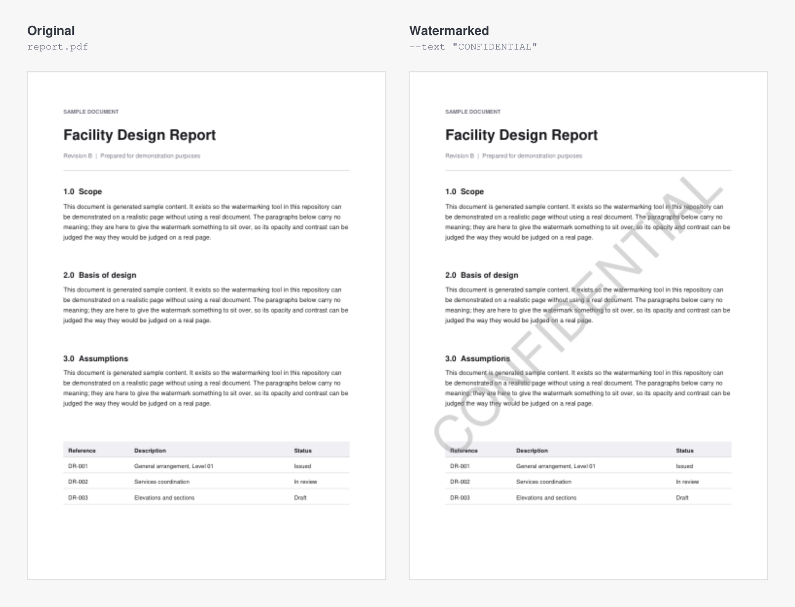

# pdf-watermark

Stamp a diagonal text watermark across every page of a PDF — one file, a whole
folder, or the same document set watermarked separately for each recipient.

Built on [PyMuPDF](https://pymupdf.readthedocs.io/). No font files, no external
binaries, no network access. Originals are never modified; every watermarked
file is written as a new copy.



```
python batch_watermark.py my_folder --text "CONFIDENTIAL"
```

---

## Contents

- [Why this exists](#why-this-exists)
- [Step by step, from nothing](#step-by-step-from-nothing)
- [Everyday use](#everyday-use)
- [Options](#options)
- [Where the output goes](#where-the-output-goes)
- [How it fits together](#how-it-fits-together)
- [Troubleshooting](#troubleshooting)
- [Notes and limitations](#notes-and-limitations)

---

## Why this exists

Most watermarking tools assume a stack of same-sized office documents. This one
was written for mixed technical document sets — a folder holding A4 memos next
to A0 CAD drawings, some pages rotated, some generated by software that writes
unusual PDFs — where the naive approach produces watermarks that are tiny on one
page, cropped on the next, and mirrored on the one after that.

The watermark is sized from each page's own geometry, so one command handles a
document whose pages disagree about how big they are:


Three things it handles that a simple `insert_text()` loop does not:

- **Per-page sizing.** The font size is computed from each page's width, height
  and the rotation angle, so the text fills the page proportionally whether it
  is A4 or A0 — no fixed point size that only suits one paper size.
- **Rotated pages.** A page carrying a `/Rotate` entry renders in a rotated
  coordinate space. Drawing on it naively gives a mirrored or wrongly angled
  watermark. Pages are normalised to a rotation-free state first.
- **CAD-generated PDFs.** Some write an unbalanced transform into the content
  stream, which silently drags anything appended afterwards into the wrong
  coordinate space. The usual fix (`clean_contents()`) re-encodes font streams
  and can corrupt these files, so a narrower fix is applied instead.

---

## Step by step, from nothing

### 1. Check Python

Python 3.10 or newer. In a terminal:

```
python --version
```

No Python? Install it from [python.org/downloads](https://www.python.org/downloads/).
On Windows, tick **Add python.exe to PATH** in the installer.

### 2. Get the code

```
git clone https://github.com/Fahim8371/pdf-watermark.git
cd pdf-watermark
```

No git? Use the green **Code** button above → **Download ZIP**, unzip it, then
open a terminal in the unzipped folder.

### 3. Install the one dependency

```
pip install -r requirements.txt
```

That is PyMuPDF and nothing else.

### 4. Make a document to practise on

So your first run is not against something that matters:

```
python examples/make_sample.py
```

This writes `examples/sample_report.pdf` — a two-page document with an A4 report
page and an A3 drawing page.

### 5. Watermark it

```
python batch_watermark.py examples/sample_report.pdf --text "CONFIDENTIAL"
```

```
1 PDF(s) x 1 watermark(s) = 1 file(s) to write

["CONFIDENTIAL"]
  -> ...\pdf-watermark\examples
  OK  sample_report.pdf

Done. 1 succeeded, 0 failed.
```

Open `examples/sample_report_watermarked.pdf`. The original is untouched.

### 6. Now do it to a folder

Point it at a folder and it works through every PDF inside, including
subfolders, ignoring everything that is not a PDF.

**Always dry-run an unfamiliar folder first.** Nothing is written; you get the
exact list of what would be:

```
python batch_watermark.py my_folder --text "CONFIDENTIAL" --dry-run
```

```
2 PDF(s) x 1 watermark(s) = 2 file(s) to write [DRY RUN]
(1 non-PDF file(s) ignored)

["CONFIDENTIAL"]
  -> ...\my_folder _CONFIDENTIAL_Watermarked
  -> ...\my_folder _CONFIDENTIAL_Watermarked\drawings
  [dry-run] drawings\plan.pdf
  [dry-run] report.pdf

Dry run complete - no files written.
```

Happy with the list? Run it again without `--dry-run`.

### 7. Check the result

Open a couple of the output files. If the watermark is too strong or too faint
over your particular documents, adjust and re-run — the originals are still
there, so there is nothing to undo:

```
python batch_watermark.py my_folder --text "CONFIDENTIAL" --opacity 0.25
```

---

## Everyday use

### A single file

```
python batch_watermark.py report.pdf --text "DRAFT"
```

Writes `report_watermarked.pdf` next to the original.

### A folder, recursively

```
python batch_watermark.py my_folder --text "CONFIDENTIAL"
```

### Folders and files together

```
python batch_watermark.py my_folder extra.pdf another_folder --text "DRAFT"
```

Paths with spaces need quotes: `"C:\Users\me\My Documents\pack"`.

### One run, several recipients

Repeat `--text` to write a separate, individually watermarked copy of the whole
set per recipient. This is the case the tool was actually built for: sending the
same document pack to several parties, with each copy traceable back to whoever
it went to.

```
python batch_watermark.py my_folder --text "For Acme" --text "For Globex"
```

`--company` is shorthand for the common phrasing — each name becomes
`CONFIDENTIAL - <name>`:

```
python batch_watermark.py my_folder --company Acme Globex
```

```
2 PDF(s) x 2 watermark(s) = 4 file(s) to write

["CONFIDENTIAL - Acme"]
  -> ...\my_folder _CONFIDENTIAL - Acme_Watermarked
  OK  drawings\plan.pdf
  OK  report.pdf

["CONFIDENTIAL - Globex"]
  -> ...\my_folder _CONFIDENTIAL - Globex_Watermarked
  OK  drawings\plan.pdf
  OK  report.pdf

Done. 4 succeeded, 0 failed.
```

---

## Options


| Flag | Default | What it does |
| --- | --- | --- |
| `--text`, `-t` | — | Watermark text. Repeat for one copy set per text. |
| `--company`, `-c` | — | Shorthand: each name becomes `CONFIDENTIAL - <name>`. |
| `--out`, `-o` | alongside each source | Where output is written. |
| `--tile` | `1` | `1` draws one large centred line. Higher values tile N diagonal bands of repeating text — harder to crop out, busier to read through. |
| `--opacity` | `0.4` | `0` invisible, `1` fully opaque. |
| `--angle` | `45` | Degrees, counter-clockwise from horizontal. `0` is a horizontal band. |
| `--suffix` | `_Watermarked` | Appended to each output folder name. |
| `--dry-run` | off | Print what would be written, write nothing. |

Colour and font are not flags, since they change far less often. They live in
the `CONFIG` block at the top of `watermark.py`, commented value by value:

```python
FONT_NAME  = "helv"             # built-in: helv, tiro, cour (+ bold/italic)
FONT_COLOR = (0.6, 0.6, 0.6)    # RGB as 0-1 floats, not 0-255
OPACITY    = 0.4                # the default --opacity
```

Run `python batch_watermark.py --help` for the full list at any time.

---

## Where the output goes

A folder is copied to a sibling folder next to it, with subfolder structure
preserved:

```
my_folder/                                  <- untouched
    report.pdf
    drawings/plan.pdf
my_folder _CONFIDENTIAL_Watermarked/        <- created
    report_watermarked.pdf
    drawings/plan_watermarked.pdf
```

A single file is written next to the original:

```
report.pdf                                  <- untouched
report_watermarked.pdf                      <- created
```

`--out DIR` redirects either one. With several watermark texts, output folders
already differ by text and single-file names get the text added too, so nothing
from one text overwrites another.

Re-running is safe: previous output is recognised by folder name and filename
suffix and skipped, so watermarks do not stack up on a second pass.

---

## How it fits together

**`watermark.py`** — the engine. Page geometry, font sizing, rotation
normalisation, and the drawing itself, plus a small CLI of its own for quick
one-off jobs. The `CONFIG` block at the top holds every appearance default.

**`batch_watermark.py`** — the command line around it: collecting paths, naming
outputs, applying several watermarks in one run. This is the one to use.

**`examples/make_sample.py`** — generates the sample document used above.

The engine is importable if you want to drive it yourself:

```python
import pymupdf
import watermark as wm

wm.WATERMARK_TEXT = "CONFIDENTIAL"
wm.OPACITY = 0.3

doc = pymupdf.open("report.pdf")
for page in doc:
    wm.watermark_page(page)
doc.save("report_watermarked.pdf")
```

Every config value is read at draw time, so changing one between documents takes
effect immediately.

---

## Troubleshooting

**`ModuleNotFoundError: No module named 'pymupdf'`**
The dependency is not installed for the Python you are running. Try
`python -m pip install pymupdf`.

**`ModuleNotFoundError: No module named 'watermark'`**
`batch_watermark.py` imports its engine from the same folder. Run it from inside
the repository, or pass a full path to the script.

**`no watermark text given`**
Every run needs `--text "SOMETHING"` or `--company NAME`. There is no default
text on purpose — a watermark naming the wrong party is worse than none.

**Nothing happened, "No PDFs found"**
The folder holds no PDFs, or everything in it was recognised as previous output.
Output is skipped by folder name (ending in `_Watermarked`) and by filename
(ending in `_watermarked.pdf`).

**One file failed but the rest worked**
Encrypted or damaged PDFs are reported with `ERR` and skipped, so one bad file
never abandons a long batch. The exit code is `1` if anything failed.

**The watermark is too subtle to notice / too loud to read through**
`--opacity` first, then `--tile 4` if it needs to be genuinely hard to remove.

---

## Notes and limitations

- **A watermark is not access control.** It is drawn as ordinary page content,
  so anyone with the right tools can strip it out. It marks provenance and
  discourages casual redistribution; it does not protect a document. If you need
  real restrictions, encrypt the PDF or use a rights-management system.
- **The text stays selectable.** It is real text, not an image, which keeps
  files small and pages sharp, but also means it can be found by a text search.
  That is what makes the automated checks on this repo possible.
- **Encrypted PDFs are skipped.** A password-protected file fails with an error
  and the batch carries on. Decrypt it first if you need it watermarked.
- **Long paths on Windows.** Windows caps ordinary paths at 260 characters,
  which a deep folder tree plus a long watermark name passes easily. Output
  paths are written through the `\\?\` extended-length prefix, so this does not
  bite partway through a large run.
- **Scanned PDFs work but are not OCR'd.** The watermark draws fine over a
  scanned page; the underlying page just has no text layer of its own.
- **Exit code.** `0` when every file succeeded, `1` if any failed, so it can be
  used in a script or CI step.

## License

MIT — see [LICENSE](LICENSE).
